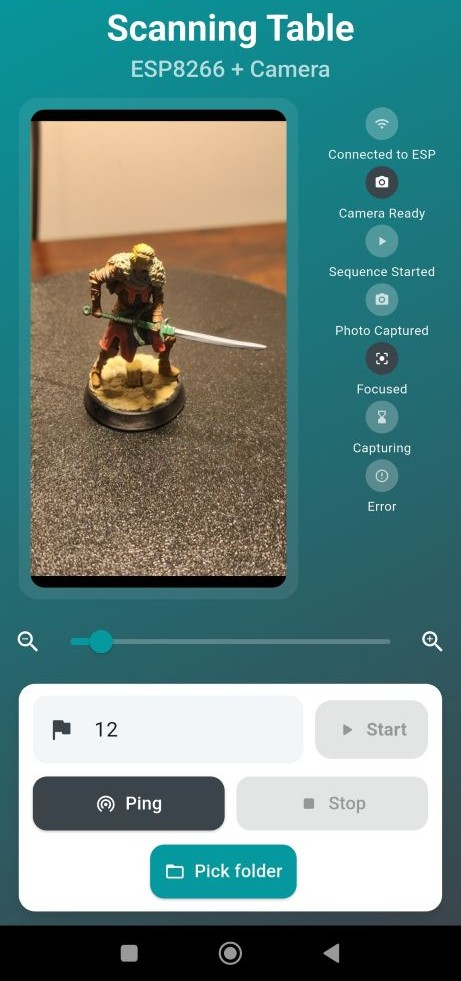

# 3D Scanning Table

This project contains all the necessary files and code to build a 3D scanning table. The system is composed of three main parts: the physical hardware (3D printed parts and electronics), the ESP8266 firmware to control the hardware, and a Flutter mobile application to automate the scanning process.

## Table of Contents

- [3D Scanning Table](#3d-scanning-table)
  - [Table of Contents](#table-of-contents)
  - [Project Overview](#project-overview)
  - [Components](#components)
    - [Hardware](#hardware)
    - [Firmware (ESP8266)](#firmware-esp8266)
    - [Mobile App (Flutter)](#mobile-app-flutter)
  - [Setup Instructions](#setup-instructions)
    - [1. Hardware Assembly](#1-hardware-assembly)
    - [2. Firmware Flashing](#2-firmware-flashing)
    - [3. Mobile App Installation](#3-mobile-app-installation)
  - [How It Works](#how-it-works)
  - [Project Structure](#project-structure)

## Project Overview

The goal of this project is to create an automated turntable for 3D photogrammetry. A stepper motor rotates the smartphone camera, stopping at predefined intervals. At each stop, a mobile application captures a photo. This process continues for a full rotation, collecting a set of images ready for processing with 3D scanning software.

The communication between the control app and the turntable is handled via a Wi-Fi network hosted by the ESP8266, allowing for a wireless and seamless operation.

## Components

### Hardware
- **3D Printed Parts:** All necessary `.stl` files for the table structure are located in the `3D Files/` directory. **They were retrieved and modified from PCB Community (All credits to the authors)**. The quantities for each part are in the file `Quantities.txt` in the `3D Files/` directory.
- **Electronics:** The system is controlled by an ESP8266 microcontroller. A custom PCB design is available in the `PCB/` directory, which simplifies the wiring of the stepper motor driver, the ESP8266, and the power supply. It is powered by a 12V power source. The bill of materials in the file `Bill of Materials.txt` inside the folder `PCB/`.
<!-- - **Stepper Motor and Driver:** 28BYJ-48 DC stepper motor + ULN2003 driver. -->


### Firmware (ESP8266)
The firmware is written in C++ using the Arduino framework. It is located in `ESP8266/scanningTable/`.

**Key Features:**
- **Wi-Fi Access Point:** The ESP8266 creates its own Wi-Fi network (SSID: `ESP_Motor_WS`, Password: `12345678`).
- **HTTP Server:** It hosts a web server that listens for commands from the mobile app. The available endpoints are:
  - `GET /status`: Returns the current state of the turntable (e.g., running, waiting for continue, current stop).
  - `POST /start`: Starts a new scanning sequence. Requires `turns` and `stops` as query parameters.
  - `POST /continue`: Resumes the sequence after a photo has been taken.
  - `POST /stop`: Immediately stops the current sequence.

### Mobile App (Flutter)
The mobile application, located in `scanning_table_app/`, provides a user-friendly interface to control the scanning process.

**Key Features:**
- **Camera Control:** Live preview from the phone's camera with digital zoom and focus adjustment.
- **Sequence Automation:** Manages the start/stop/continue commands sent to the ESP8266.
- **Automatic Photo Capture:** Takes a picture automatically each time the turntable stops.
- **File Management (SAF):** Uses Android's Storage Access Framework (SAF) to allow the user to select a custom folder for saving the captured images, ensuring they are easily accessible.
- **Real-time Status:** Displays connection status, sequence progress, and a log of events.
- **Wakelock:** Keeps the phone's screen awake during a scanning session.



## Setup Instructions

### 1. Hardware Assembly
1.  Print all the parts from the `3D Files/` directory.
2.  Assemble the mechanical structure.
3.  Solder the components onto the PCB from the `PCB/` directory or wire them on a breadboard according to the schematics.
4.  Connect the stepper motor, driver and power supply.

### 2. Firmware Flashing
1.  Install the [Arduino IDE](https://www.arduino.cc/en/software) and the ESP8266 board manager.
2.  Install the required Arduino libraries: `ESP8266WebServer` and `Stepper`.
3.  Open the `ESP8266/scanningTable/scanningTable.ino` sketch in the Arduino IDE.
4.  Select the correct ESP8266 board and COM port.
5.  Upload the sketch to the device.

### 3. Mobile App Installation
1.  Install the [Flutter SDK](https://flutter.dev/docs/get-started/install).
2.  Navigate to the app directory:
    ```sh
    cd scanning_table_app
    ```
3.  Install dependencies:
    ```sh
    flutter pub get
    ```
4.  Connect your Android phone (with Developer Mode and USB Debugging enabled).
5.  Build and install the app:
    ```sh
    flutter run
    ```
    Alternatively, build the APK and install it manually:
    ```sh
    flutter build apk
    ```
    The output will be located at `build/app/outputs/flutter-apk/app-release.apk`.

## How It Works
1.  Power on the scanning table. The ESP8266 will create a Wi-Fi network named `ESP_Motor_WS`.
2.  On your phone, connect to the `ESP_Motor_WS` Wi-Fi network using the password `12345678`.
3.  Open the Flutter application. The app will automatically try to connect to the ESP8266.
4.  Use the "Pick folder" button to select a directory where the captured images will be saved.
5.  Enter the desired number of stops for a full rotation and press "Start".
6.  The table will rotate to the first stop.
7.  The app will detect the stop, take a picture, save it to the selected folder, and send a `continue` command.
8.  The process repeats until all stops are completed.
9.  You can monitor the progress and view logs directly in the app.

## Project Structure
```
.
├── 3D Files/              # .stl files for 3D printing
├── ESP8266/               # Arduino sketches for the ESP8266
│   ├── motorTest/         # Test sketch for the motor
│   └── scanningTable/     # Main firmware with HTTP server
├── PCB/                   # PCB and schematics design files
├── scanning_table_app/    # Flutter mobile application source code
└── README.md              # This documentation file
```

