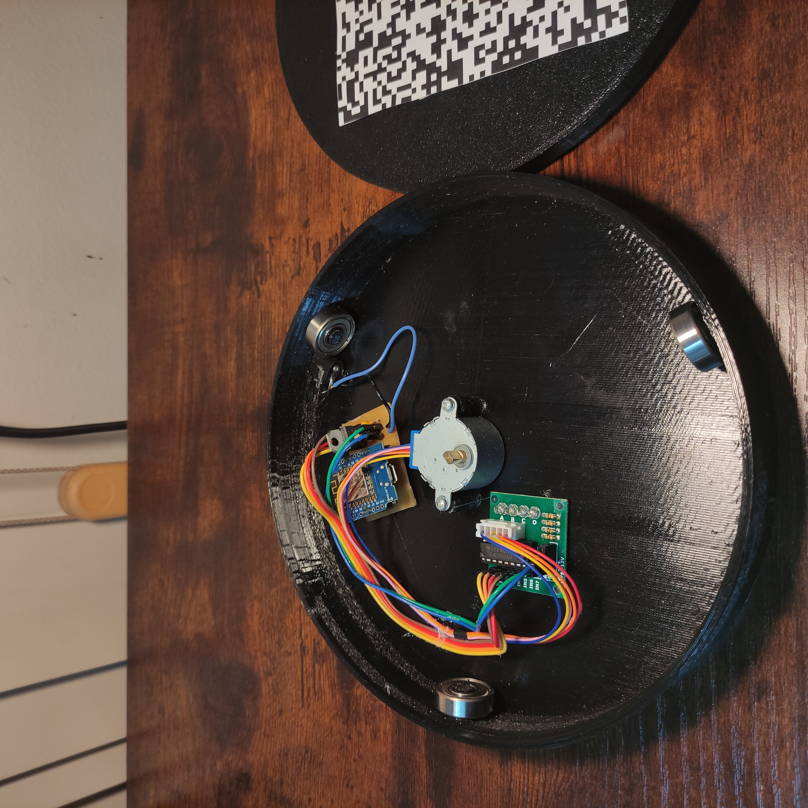
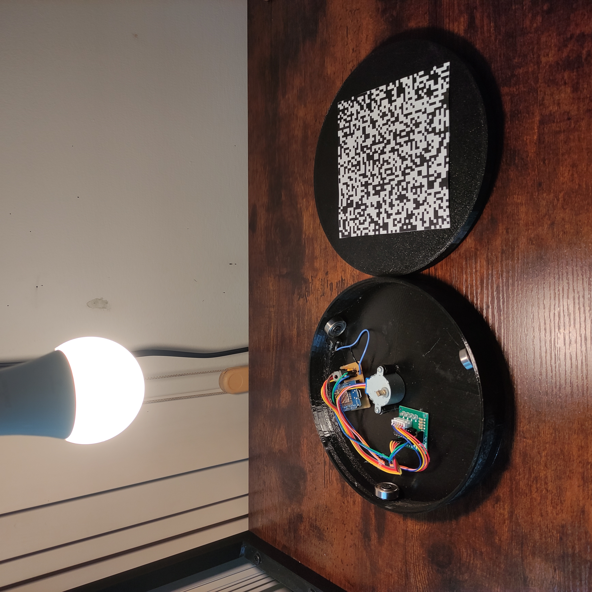
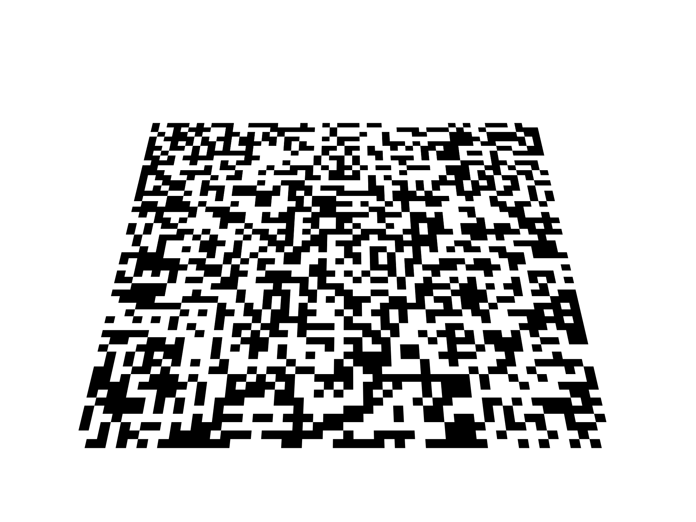

<div align="center">

# 3D Reconstruction of Small Objects

**Non-official implementation and adaptation of the paper: [Automated Low-Cost Photogrammetric Acquisition of 3D Models from Small Form-Factor Artefacts](https://www.mdpi.com/2079-9292/8/12/1441), from Collins et al., 2019**

**Note:** This implementation was performed in a **Linux** environment, with GPU with CUDA acceleration.

</div>

---

- [3D Reconstruction of Small Objects](#3d-reconstruction-of-small-objects)
- [Step 1 - Image Acquisiton hardware](#step-1---image-acquisiton-hardware)
- [Step 2 - Acquisition Software](#step-2---acquisition-software)
- [Step 3 - Taking Images](#step-3---taking-images)
- [Step 4 - Camera Geometry Estimation](#step-4---camera-geometry-estimation)
- [Step 5 - Dense Point Cloud Reconstruction](#step-5---dense-point-cloud-reconstruction)
- [Step 6 - Cropping](#step-6---cropping)
- [Step 7 - Point Cloud Registration](#step-7---point-cloud-registration)
- [Step 8 - Meshing](#step-8---meshing)
- [Step 9 - Texturing](#step-9---texturing)
  - [Running the whole pipeline in one go](#running-the-whole-pipeline-in-one-go)


---

# Step 1 - Image Acquisiton hardware

For the table, I 3D modeled and printed a structure for it. It has a base and a top plate. You can find the models in the folder [3DFiles](3DFiles/). You can print it in the way you prefer, but I recommend using PLA, 3 layers of wall width, 20% fill, and 0.2mm layer height. To aid in the table movement, I added **3 2809 bearings.** To fix the motor in place, I used 2 3mm bolts.

The pseudo-random calibration pattern was made using a code in Python, available at the file [generate_pattern.py](utils/generate_pattern.py). It generates the pattern of a 130x130 mm square with 52 squares at each side, and saves as an image.

For the hardware, I used a 28BYJ-48 Stepper Motor with a ULN2003AN DIP-16 Driver. To connect with the phone and control the motor, I am using a Wemos D1 Mini ESP8266 Board. To power it, I am using a 9V power supply and a L7805 voltage regulator, with some capacitors. To connect everything, I made a custom PCB. The bill of materials, schematics and gerber files are in the folder [PCB](PCB/).




For the lights, I followed the same method as described by the paper, with a desk lamp at 20 cm perpendicullarly appart from the rotating plate.




# Step 2 - Acquisition Software

The script to run the ESP8266 is available at [ESP8266.ino](ESP8266\ESP8266.ino). The number of rotations is fixed on 36 (10 degree interval). The ESP creates a WebServer, with a Wi-Fi name and a password. The app sends requests to the ESP, such as: `start`, `stop`, and `continue`. The ESP sends the command `waiting` to the app so it knows when to take the picture.

The [app](scanning_table_app) was made in *Flutter* and **tested on an Android device only**. It has a initial page, only allowing to move to the next page (taking pictures) when the cellphone is connected to the ESP. To start scanning the user first must to choose the folder where the images are going to be saved. After that, the user can click on `Scan` and the app + ESP does the rest automatically. If something goes wrong, the user can click on `stop`, and the operation will be stopped.

Each photo is saved as `<scan>_stop_<stop>_<timestamp>.jpg`, e.g. `01_stop_03_20260703_163620.jpg` - `<scan>` numbers each full rotation sequence within the current app session (`01` for the first press of `Scan`, `02` for the second, and so on) and resets back to `01` every time the app is (re)started, so photos from different scans in the same folder never collide or get mixed up.

The camera settings in the app are following the paper description:
- Apperture of f/1.2;
- Shutter speed of 1/4s;
- ISO 200;

**Important reminder: to connect with the ESP, the mobile data must be turned off**

# Step 3 - Taking Images

The camera was positioned a little bit different than described in the paper. Instead of at 40 degrees to the table and at 25cm distant, as describred, the images were took framing the whole calibration pattern, at less than 40 degrees. The reason for this is that phones have different focals, meaning that the images from different phones will become different, even if you keep the same parameters. *When doing this on your phone, try to make the board occupy the maximum of the image as possible and at low angles*. See an example of the virtual image, where you must try to mimic its position in the real picture:

<center></center>

Just like in the paper, I took some sets of different angles of the object (a 32mm scale minitature painted by me). The sets are in the folder [images](images/). Some examples:

**<center>Set 1:**

</center>

**<center>Set 2:**

</center>

**<center>Set 3:**

</center>

# Step 4 - Camera Geometry Estimation

Implemented in [camera_geometry_estimation.ipynb](camera_geometry_estimation.ipynb), using
[pycolmap with cuda](https://github.com/colmap/pycolmap) for feature extraction, matching and bundle
adjustment. The pipeline follows the paper: a sequence of virtual "photographs" of the calibration
plate is rendered from known viewpoints (paper spec: 12 views, 30&deg; apart, 45&deg; elevation;
the notebook defaults to 24 views/15&deg; steps for denser real-photo coverage - see its parameters
cell to reproduce the literal paper spec), registered with COLMAP at their exact known
intrinsics/pose, and used as a fixed calibration model that the real photographs are localised
against via incremental bundle adjustment (`fix_existing_frames` + `constant_cameras` keep the
virtual poses/intrinsics fixed throughout; only the real cameras are refined). A final
retriangulation pass (using every registered camera, not just the virtual ones) then fills out the
sparse point cloud with the artefact's own geometry, not just the calibration plate, before the
virtual photographs are removed, leaving calibrated real cameras plus a sparse point cloud ready
for dense reconstruction.

One thing this replica needed that the paper's summary doesn't spell out: **real photos only
reliably register when close in azimuth to a virtual view.** Matching a clean, synthetic render
against a real photograph (different lighting, print quality, JPEG compression, lens blur) is much
harder than matching two real photos to each other - hence the denser 24-view default above.

Not every real photograph is guaranteed to register - the notebook reports how many did, and is
intentionally bounded to a fixed runtime (`MAX_RUNTIME_SECONDS`, `MAX_REG_TRIALS=1`) rather than
retrying indefinitely. Registration also includes plausibility filters (implausible
camera-to-plate distance, near-duplicate positions from COLMAP's linear solver failing on a
poorly-conditioned planar-target fit) that discard failed estimates rather than keep them. If you hit not getting real cameras, consider tuning `ABS_POSE_MIN_NUM_INLIERS` /
`N_VIRTUAL_VIEWS` for the affected set, or re-running with a higher `MAX_REG_TRIALS`.

# Step 5 - Dense Point Cloud Reconstruction

Implemented in [dense_reconstruction.ipynb](dense_reconstruction.ipynb). The paper uses CMVS/PMVS
(Furukawa's clustering-views-for-multi-view-stereo toolchain) for this step. That toolchain has no
pip package, is unmaintained, and COLMAP's own docs describe it as superseded by COLMAP's own dense
pipeline - **PatchMatchStereo** (per-image depth/normal maps) followed by **StereoFusion** (merging
those into one point cloud) - which this notebook uses instead, via the same `pycolmap` library
already used for calibration.

The pipeline: load Step 4's calibrated real cameras and reuse the exact downscaled photographs it
already calibrated against (`outputs/<set>/work`, no separate re-downscale needed) &rarr; undistort
into a COLMAP dense workspace &rarr; PatchMatchStereo for per-image depth/normal maps &rarr;
StereoFusion into one dense, coloured point cloud &rarr; restrict to a rough region of interest
around the artefact (not the paper's dedicated cropping stage, which comes later) &rarr; attempt to
downsample towards target point densities (points per mm&sup2; of the ROI's bounding-box surface
area, standing in for actual surface area until a mesh exists).

**On target density**: this step was scoped for 100 and 300 points/mm&sup2;. Validated on `set_1`
(35 photos, downscaled to 2000x1500 as Step 4 left them), the achieved density came out to
**~6 points/mm&sup2;** - one to two orders of magnitude below either target. The notebook keeps
both targets as explicit parameters and reports the honest gap (via
`dense_reconstruction.downsample_to_density`'s `reached_target=False` path) rather than silently
substituting a different number or fabricating points a camera never actually resolved. This is a
property of the input photos (phone camera, ~20-25cm working distance, downscaled for tractable
runtime) more than the algorithm - raising Step 4's `MAX_LONG_EDGE` (more pixels on the artefact per
photo) and/or taking more, closer photos would likely close some of that gap, at the cost of a much
longer `PatchMatchStereo` runtime (full 4000x3000 photos measured ~60-90s/image on the dev GPU,
vs. ~35 minutes total for all of `set_1` at 2000x1500). Even though the poits density were not as high as stated in the paper, the reconstruction level of details is *impressive*.

# Step 6 - Cropping

Implemented in [cropping.ipynb](cropping.ipynb). The paper's method: an axis-aligned crop box
with x/y extent equal to the calibration pattern's own size (130&times;130&nbsp;mm, centred at
the world origin, since the calibration model is defined at z&nbsp;=&nbsp;0), and a z lower-limit
found by sliding a 1&nbsp;mm slab upward from 2&nbsp;mm above the turntable, averaging point
luminosity, until it crosses a threshold - the point where dark supporting material gives way to
the lighter artefact.

Three things came up validating this against real data (`set_1`-`set_3`) that the paper's setup
doesn't need to deal with:

- **A Step 4 orientation bug.** This replica's real-camera reconstruction comes out mirrored
  through the z&nbsp;=&nbsp;0 plane - the artefact reconstructs *below* the turntable instead of
  above it, almost certainly Step 4's own coplanar-target pose ambiguity (see
  `plate_geometry.look_at_origin`'s docstring) resolving to the wrong sign for this rig.
  `cropping.correct_z_axis_inversion` negates z as a workaround at the data-consumption end so the
  rest of the crop logic (written straight from the paper, which assumes the artefact sits above
  the turntable) applies correctly. The proper fix belongs in `colmap_calibration.py`'s pose
  disambiguation, not here.
- **No dark support material.** The images in `images/set_*` have the miniature sitting directly
  on the calibration pattern - no foam raiser. In practice this doesn't matter: the model's own
  paint is darker near its base and lightens further up, enough of a luminosity gradient for the
  paper's sweep to still land on a sensible lower limit.
- **A z upper-limit isn't in the paper**, but was added here because this replica's dense
  reconstruction consistently leaves one small clump of disconnected debris floating well above
  the artefact (likely a specular-highlight fusion ghost) - visible as a gap in point density
  between the artefact's own tapering mass and that clump. `cropping.find_upper_z_limit` cuts at
  the first sufficiently-thick run of near-empty slices above the lower limit. It's a narrow,
  generic density-gap heuristic, not a general outlier remover - Step 7 (Point Cloud
  Registration)'s own merge stage still has real pruning work to do on whatever survives cropping.

# Step 7 - Point Cloud Registration

Implemented in [point_cloud_registration.ipynb](point_cloud_registration.ipynb). This covers the
paper's full Section 2.4.4 - registration *and* the confidence-weighted merge it also describes,
since the paper treats both under one heading. Each of `set_1`-`set_3` was captured with the
object resting differently on the turntable, so Step 6's three cropped point-clouds are genuine
partial views, each in its own independent frame, that need combining:

1. **Coarse alignment** - paper spec: Super4PCS. No maintained pip package or Python binding
   exists for either 4PCS or Super4PCS, so `utils/registration.py`'s `coarse_align` implements the
   same family of algorithm from scratch: a RANSAC search over congruent point triples (matching
   pairwise distances, scored by largest-common-pointset overlap) rather than Mellado et al.'s
   specific coplanar-4-point/smart-indexing formulation - that indexing is what makes Super4PCS
   *fast*; it doesn't change what a correct coarse alignment looks like.
2. **Fine alignment** - a Weighted ICP (`weighted_icp`), exactly as described: each nearest-
   neighbour correspondence is weighted by the product of its two points' confidence values
   (Equation 3), so precisely-reconstructed points dominate the fit.
3. **Confidence** (Equation 2) needs a per-point surface normal, which Step 5's `pycolmap`-based
   dense reconstruction doesn't preserve (its `Reconstruction` object drops the photo-consistency
   normals PatchMatchStereo/StereoFusion compute internally). `estimate_normals` substitutes a
   standard PCA-over-local-neighbours normal, oriented outward from the cloud's own centroid.
4. **Merge** (Equation 4): once registered, close point pairs across clouds are confidence-
   weighted-interpolated into one rather than kept as two redundant, possibly conflicting points;
   unique points are kept as-is. This also does this replica's pruning - there's no separate
   pruning stage.

# Step 8 - Meshing

Implemented in [meshing.ipynb](meshing.ipynb) via `utils/meshing.py`, following the paper's
Section 2.4.5 directly:

> Following the point-cloud registration and merging operations described above, the points
> require connecting to form a surface mesh before texturing can be applied. Poisson surface
> reconstruction was used for this stage and was chosen for its relative simplicity and
> reliability. Some care is needed to avoid loss of detail on inscribed surfaces. We found that
> an octree depth of 14 gave a good compromise, retaining the detail of the inscriptions with a
> tractable computational complexity.

One things came up building this against real data:

- **Poisson reconstructs a phantom "bubble" surface.** Poisson fits one *global* implicit
  function across the whole point-cloud, so even a handful of points far from everything else -
  each still gets a plausible local normal - can pull that function's zero-level-set out into a
  sizeable, completely disconnected surface floating in empty space. Diagnosed on this replica's
  own merged cloud: 67,805 of 67,820 points form one connected component at a 1.5mm radius, and
  the rest are 1-4-point fragments (registration/fusion debris, not real geometry) scattered
  elsewhere. `meshing.remove_isolated_points` removes those from the *point-cloud*, before Poisson
  ever sees them, rather than trying to identify and trim the mesh it produces from them
  afterwards - which needs the (expensive) reconstruction to have already run once just to find
  out.

# Step 9 - Texturing

Implemented in [texturing.ipynb](texturing.ipynb) via `utils/texturing.py`, following the
paper's Section 2.4.6: project the original photographs onto Step 8's mesh using the camera
positions from Step 4's calibration. Each registered real camera is carried through this
replica's own Step 4 &rarr; Step 8 chain into the mesh's common frame - this replica's version
of the paper's "VmnMn" (camera Vmn transformed by the per-acquisition model-matrix Mn):

- **The z-axis correction has no valid rigid-body camera analogue.** Step 6 corrects the
  *points* by negating z outright (`cropping.correct_z_axis_inversion`) - a reflection, not a
  rotation, so there's no way to move a *camera* the same way and still call the result a
  physically normal camera. `texturing.flip_z_camera_pose` derives the (improper, but
  correctly-reprojecting) substitute instead: composing the original camera rotation with the
  z-flip *on the right* reprojects corrected-frame points onto exactly the same pixels the
  original, unmirrored camera always did, even though the resulting matrix has det = -1. This
  was validated against this replica's own real cameras, not just derived on paper: repositioned
  into the mesh's common frame, all 100 registered real cameras across the three sets look at
  the mesh's own centroid to within about 6-10&deg; (the notebook's own sanity-check step) -
  before landing on this formula, they were off by ~173&deg;, i.e. facing almost exactly
  backwards.
- **Step 7's registration transform** carries the camera the same way
  `registration.apply_transform` carries points (`texturing.compose_with_registration`).

The paper's own tool for this step is MeshLab (via UV-atlas texturing from registered
cameras). `pymeshlab`'s equivalent filter turned out to be broken under headless/server
execution in this environment (a long-standing, version-spanning upstream issue, not specific
to this setup), so this replica instead uses `open3d` (already a project dependency,
`meshing.py`) to project every registered, undistorted photo directly onto the mesh and paint
each *vertex* with the occlusion-aware, multi-view-blended result - not a UV-mapped texture
atlas, but real photographic colour, correctly occlusion-tested per camera via `open3d`'s own
`RaycastingScene` (Embree-backed, CPU-only). Two things needed correcting empirically before
this was trustworthy, not just plausible-looking - both documented in
`texturing.texture_mesh_vertex_colors`'s own docstring:

- **Ray direction.** Casting the occlusion ray *from* each vertex *towards* the camera
  routinely self-intersects an adjacent triangle at t &asymp; 0 ("shadow acne") - this mesh is
  not watertight or edge-manifold (`mesh.is_watertight()` is `False`), so no fixed offset
  reliably escaped it. Casting *from the camera towards* the vertex instead avoids the problem
  entirely (the ray origin is never near the mesh surface) and doubles as a proper z-buffer-style
  visibility test.
- **Occlusion tolerance.** Initially rejected a vertex whenever the ray hit anything before
  reaching it, which - audited directly against this replica's own mesh - was rejecting even
  vertices whose normals point almost exactly at the camera. Tracing a few of those hits showed
  real geometry several mm to multiple cm away, not numerical noise: this is a small,
  geometrically complex hand-painted miniature (limbs, weapon, folds), photographed at one fixed
  camera elevation per set, so most surface points genuinely are only visible from a narrow slice
  of the ~100 photos across all three sets. A wider tolerance (1.5&nbsp;mm - comfortably above
  this mesh's own sub-mm surface noise, well below genuine occlusion distances) fixed the
  false rejections without papering over real ones; final coverage is 77% of vertices coloured
  directly from a photo, the rest kept their Step 7/8 point-cloud colour rather than being left
  uncoloured.

# Running the whole pipeline in one go

Steps 4-9 are also available as a single script, [reconstruct.py](reconstruct.py), instead of
six notebooks run one at a time by hand. It auto-discovers every set folder under `images/`
(no `SET_NAME` to edit per run) and drives camera geometry estimation through texturing
end-to-end, set by set, then registers, meshes, and textures whatever sets made it through:

```
python reconstruct.py
```

A few things this script does differently from the notebooks it consolidates, all by design
rather than oversight:

- **No plots.** The notebooks' `matplotlib`/`open3d` visualisations are for inspecting one run
  interactively; this script only logs text - including the same "something might be wrong"
  signals the notebooks otherwise show as a chart to eyeball (a low camera-registration rate, a
  weak coarse-alignment score, ICP not converging, low vertex-photo coverage, and so on) as
  `logging.warning` calls instead.
- **A bad set doesn't sink the run.** Camera geometry, dense reconstruction, and cropping run
  per set inside a `try`/`except`; a set that fails is logged and skipped, and registration/
  meshing/texturing proceed with whatever sets are left (at least one has to succeed).
- **Most intermediates never touch disk.** Cropped points, the merged cloud, the mesh, and each
  set's registration transform stay as in-memory Python objects passed straight from one stage
  to the next, rather than round-tripping through the PLY/JSON files separate notebooks need.
  Only what COLMAP's own file-based API requires (its database, plus several reconstruction/
  dense-workspace directories) still lands on disk mid-run.
- **Downscaling is optional.** `--max-long-edge` changes the notebooks' default of 2000px;
  `--no-downscale` processes the original photographs at full resolution.
- **Everything intermediate is deleted once texturing finishes**, leaving only
  `outputs/mesh/mesh.ply` and `outputs/textured/textured.ply` - pass `--keep-intermediates` to
  leave a run's working files in place instead (e.g. for debugging a failed/flagged set).

**Requires a CUDA GPU** (Step 5, PatchMatchStereo, has no CPU fallback) - the script checks for
one via `nvidia-smi` at startup and logs a warning rather than failing silently deep into the
first set if none is found. See `python reconstruct.py --help` for the full list of overrides
(sets to include, reference set, thread count, random seed, log level, ...).
